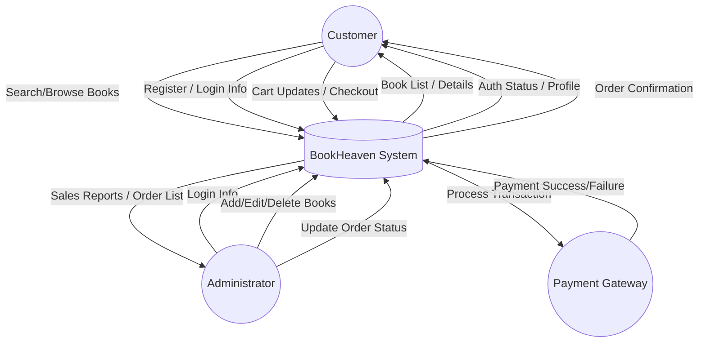
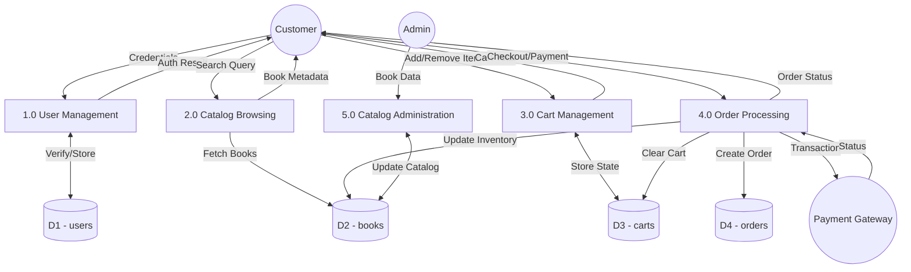
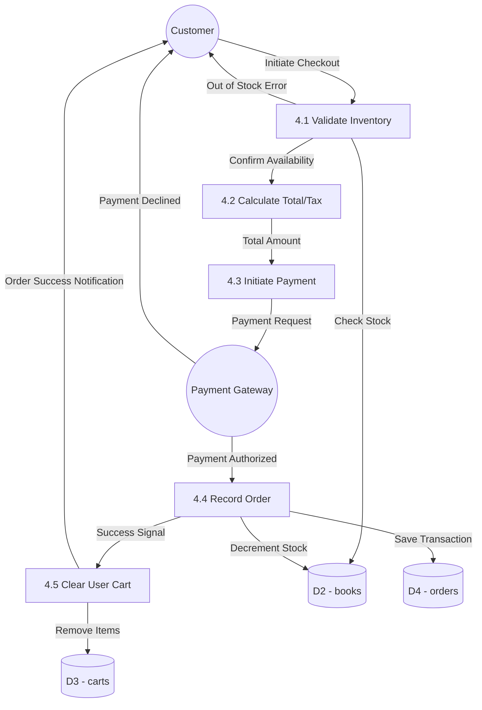

# Data Flow Diagrams (DFD) - BookHeaven

This document contains the Data Flow Diagrams (DFD) for the BookHeaven application at Level 0, Level 1, and Level 2.

---

## 🔝 1. DFD Level 0: Context Diagram

The Context Diagram shows the entire system as a single process and its interactions with external entities.

---

## 📂 2. DFD Level 1: Functional Breakdown

Level 1 breaks down the system into its primary functional processes and shows the data flow between them and the data stores.

---

## 🔍 3. DFD Level 2: Detailed Order Checkout Process (Process 4.0)

Level 2 provides a detailed view of the **Order Processing** function, showing how the system handles a checkout request.

---

### *Key Details:*
- **D1 (users)**: Stores both Customer and Administrator profiles (unified model).
- **D2 (books)**: Contains the catalog, price data, and stock quantities.
- **D3 (carts)**: Session-based or persistent JSON store of active cart items.
- **D4 (orders)**: Immutable record of transactions, including snapshots of purchased items.
